You will continue to develop your application from the point you arrived at the end of week 7. The material that follows comes with the assumption that you have done all the exercises of the previous week. In case you have not done all of them, you can take the sample answer of the previous week from the submission system.

This part is graded separately from the "base course". The part has 17 exercises. You need to complete 16 of those to get the ECTS credit registered. 

This part is provided by four awesome developers from Kisko Labs: [Eetu Mattila](https://github.com/zHarrowed), [Teemu Palokangas](https://github.com/palokangas), [Teemu Tammela](https://github.com/teemutammela), and [Kimmo Salonen](https://github.com/KimmoSalonen). [Kisko Labs](https://www.kiskolabs.com/en/) is a consultancy firm based in Helsinki, which has successfully used Ruby on Rails in various customer products for more than a decade. Check out [this video](https://www.youtube.com/watch?v=qyWdcRQfqI4&t=1s) for more!

## Prerequisites

Two of the three topics covered in this part are using just Ruby. The last topic (Stimulus) uses JavaScript and also some browser DOM APIs. If you have no experience using JavaScript on the browser side, the last topic might be quite challenging.

## Hotwire

Ruby on Rails version 7.x introduces a new functionality called [Hotwire](https://hotwired.dev/), aimed at simplifying the creation of dynamic views with minimal reliance on JavaScript. Hotwire empowers Rails developers to incorporate partial reloading of user interface elements in a similar fashion to popular JavaScript libraries like [React](https://react.dev/), all while leveraging the familiar syntax of the Ruby language.

### Why Hotwire?

Throughout its history, the Rails framework has been renowned for its ability to enable the rapid development of **fully-featured applications**. However, over the past 15 years, the concept of a _"fully-featured application"_ has evolved significantly. Today's users have come to expect dynamic, mobile-friendly experiences that encompass faster, partial, and interactive page loads.

To meet these expectations, developers have had to rely on additional software tools, such as the React library, to build the necessary functionality. Unfortunately, this approach adds complexity to the applications and often diminishes the role of the View component within the Rails [MVC](https://en.wikipedia.org/wiki/Model%E2%80%93view%E2%80%93controller) architecture, reducing it to merely serving as a [REST](https://en.wikipedia.org/wiki/Representational_state_transfer) or [GraphQL](https://en.wikipedia.org/wiki/GraphQL) API.

With the introduction of Hotwire, Rails aims to tackle the challenges posed by the rapidly evolving JavaScript landscape. This is in contrast to the more steadily-paced Ruby ecosystem, which tends to favor incremental and conservative evolution. Hotwire offers a more streamlined and cohesive approach to fulfilling the requirements of full-featured, full-stack applications. It achieves this by eliminating the reliance on disparate tools and aligning with the ethos of Rails as a comprehensive platform for web application development. Hotwire provides the tools to construct dynamic and interactive user experiences while maintaining consistency with the familiar Rails paradigms.

## Introduction to Hotwire Components

Hotwire encompasses three core components, each serving a specific purpose: Turbo, Stimulus, and Strada (not covered in this course).

1. **Turbo**

**Turbo Frames** and **Turbo Streams** enhance page loading speed by dividing the page into components and facilitating dynamic updates.

- **Turbo Streams over HTTP** - Delivering updates directly through HTTP responses, reducing page reloads.
- **Turbo Streams over Action Cable** - Real-time updates using Action Cable's WebSocket framework.
- **WebSockets with Turbo** - Bidirectional communication for real-time updates and interactivity.

2. **Stimulus**

Stimulus is a lightweight JavaScript framework that enhances interactivity and user interactions in server-rendered HTML views. By attaching JavaScript behavior to HTML elements, it improves the user experience without complex frameworks or extensive coding.

3. **Strada**

Strada is an extension of Hotwire that allows developers to build iOS and Android applications using Rails and Turbo. Currently, Strada is being developed as separate repositories: [turbo-ios](https://github.com/hotwired/turbo-ios) for iOS and [turbo-android](https://github.com/hotwired/turbo-android) for Android, respectively.

## Turbo Frames, getting ready

Before we start, let us simplify our app a bit. Start by removing the mini profiler by deleting the following line from <i>Gemfile</i>

```
gem 'rack-mini-profiler'
```

and by running _bundle install_. 

Let us also remove all the code that is implementing the [server-side caching](https://github.com/mluukkai/WebPalvelinohjelmointi2023/blob/main/english/week7.md#server-caching-functionality). So from the view templates, we get rid of all the the _cache_ elements that wrap the real page content. Eg. in _views/beers/index.html.erb_ we should get rid of this element that wraps the real content:

```html
<h1>Beers</h1>

<% cache "beerlist-#{@order}", skip_digest: true do %>
  <div id="beers">
    <table class="table table-striped table-hover">
       ...
    </table>
  </div>
<% end %>
```

and from the corresponding controllers, the guards that prevent full page render should also be removed. Eg. in the _controllers/beers.rb_ the change is the following: 

```ruby
  def index
    @order = params[:order] || 'name'

    # remove this line:
    return if request.format.html? && fragment_exist?("beerlist-#{@order}")

    @beers = Beer.all

    @beers = case @order
      when "name" then @beers.sort_by(&:name)
      when "brewery" then @beers.sort_by { |b| b.brewery.name }
      when "style" then @beers.sort_by { |b| b.style.name }
      when "rating" then @beers.sort_by(&:average_rating).reverse
    end
  end
```

Now we are ready to begin!

### The first steps

Turbo Frames provide a convenient way to update specific parts of a page upon request, allowing us to focus on updating only the necessary content while keeping the rest of the page intact.

Let us add a Turbo Frame that contains a link element to the bottom of the styles page, that is, to the view _views/styles/index.html.erb_:

```html
<h1>Styles</h1>

<div id="styles">
  <% @styles.each do |style| %>
    <p>
      <%= link_to style.name, style %>
    </p>
  <% end %>
</div>

<%= link_to "New style", new_style_path %>

<br><br>

<%= turbo_frame_tag "about_style" do %>
  <%= link_to "about", styles_path %>
<% end %>
```

The Turbo Frame is created with a helper function <i>turbo_frame_tag</i> that has an identifier as a parameter. We use now the string _"about_style_"_ as the identifier.

The generated HTML looks like the following:

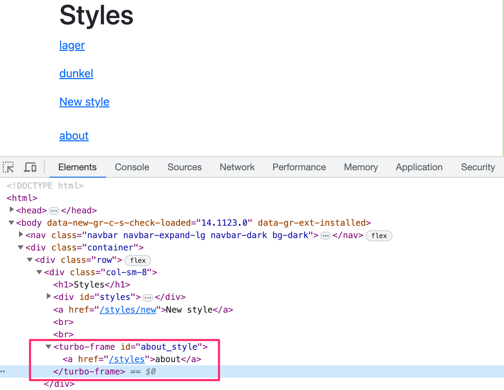

So the frame has just a link element that points back to the page itself. We intend to show some information about beer styles within the Turbo Frame when the user clicks the link.

Let us now create a partial */views/styles/_about.html.erb* that also has the same Turbo Frame ID:

Now when the user clicks the link, that creates a GET request to the same URL and the request is handled by the function _index_ of the _beers_ controller. We can use the helper function *turbo_frame_request?* to detect the Turbo request and handle it accordingly:

```rb
class StylesController < ApplicationController

  def index
    if turbo_frame_request?
      # this was a request from the Turbo Frame
      render partial: 'about'
    else
      # this was a normal requesst
      @styles = Style.all
    end
  end

  // ...
end
```

So in case of a turbo request (that is link "about" is clicked), instead of a full page reload only the partial <i>about</i> is rendered. 

From the console, we can also see, that the GET request caused by the link clicking within the frame has a special header _Turbo frame_ that tells the Rails controller to treat the request as a turbo request and **not** cause a full page reload:


We are now using the index controller function both for rendering the whole styles page and for the partial that renders the about information. Let us separate the partial rendering to on own controller function. The *routes.rb* extends as follows

```rb
Rails.application.routes.draw do
  resources :styles do
    get 'about', on: :collection
  end
  # ...
end
```

The controller cleans up a bit:

```rb
class StylesController < ApplicationController
  before_action :set_style, only: %i[show edit update destroy]

  def index
    # now this takes only care of the full page reloads
    @styles = Style.all
  end

  # own controller function for the partial
  def about 
    render partial: 'about'
  end
  # ...
end
```

The link is changed accordingly:

```html
<%= turbo_frame_tag "about_style" do %>
  <%= link_to "about", about_styles_path %>
<% end %>
```

#### Rendering style details on demand

Instead of having just an individual page for each style, let us show the style details on the styles page when the user clicks a style name on the list. We start by wrapping the style list in a Turbo Frame:

```html
<h1>Styles</h1>

<div id="styles">
  <%= turbo_frame_tag "styles" do %>
    <% @styles.each do |style| %>
      <%= link_to style.name, style %>
    <% end %>
  <% end %>
</div>
```

We add the following to partial *_details.html.erb* that shows besides the style name, its description and the beers of that style:

```html
<%= turbo_frame_tag "styles" do %>
  <h3><%= style.name %></h3>
  <p>
    <strong>Description:</strong>
    <%= style.description %>
  </p>

  <h4>beers</h4>

  <ul>
    <% @style.beers.each do |beer| %>
      <li>
        <%= link_to beer.name, beer %>
      </li>
    <% end %>
  </ul>  
<% end %>
```

Clicking a style name now causes a Turbo Frame request for a single style, and the controller is altered to render the above partial in this case:

```rb
class StylesController < ApplicationController
  # ...

  def show
    if turbo_frame_request?
      render partial: 'details', locals: { style: @style } 
    end
    # the default is a full page reload
  end

  # ...
end
```

Notice now that the partial is given the _style_ as a variable!

Now when a style name is clicked, the list of styles is **replaced** with the details of a particular style.

#### Targetting a different frame

This is perhaps not quite what we want. Instead, let the style list remain visible all the time, and add a new Turbo Frame (with ID "style_details") where the details of the clicked style are shown:

```html
<div id="styles">
  <%= turbo_frame_tag "styles" do %>
    <% @styles.each do |style| %>
      <%= link_to style.name, style, data: { turbo_frame: "style_details" } %>
    <% end %>
  <% end %>

  <%= turbo_frame_tag "style_details" do %>
  <% end %>  
</div>

<%= link_to "New style", new_style_path %>
</div>
```

Since we now want to target a _different_ Turbo Frame instead of the one where links reside, we must define the targeted frame as an attribute. As seen from the above snippet it is done as follows:

```html
link_to style.name, style, data: { turbo_frame: "style_details" }
```

The Turbo Frame tag in the partial _details.html.erb needs to be changed accordingly:

```html
<%= turbo_frame_tag "style_details" do %>
  <h3><%= style.name %></h3>
  <p>
    <strong>Description:</strong>
    <%= style.description %>
  </p>

  # ...
<% end %>
```

The result is finally as we expected it to be:

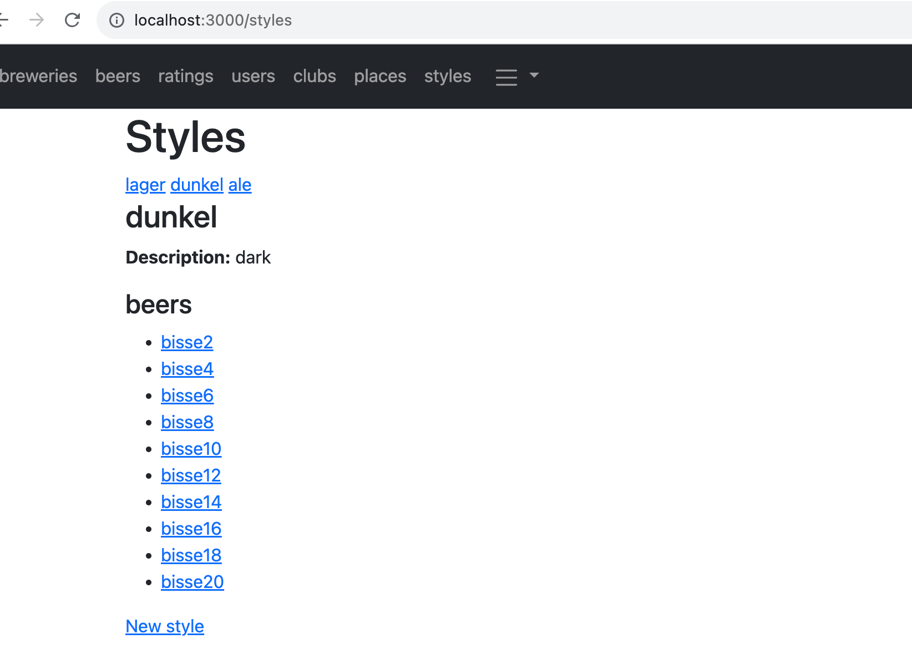

### A very important thing to remember

It is **EXTREMELY IMPORTANT** to follow all the possible error messages, in the Rails console and the network tab of the browser especially when working with the Hotwire. For unknown reasons, some beginners do not believe this and end up in deep trouble. Do not even think taking that dark path... 

<blockquote>

## Exercise 1

Extend the user page so that when clicking a rating, the basic info of the rated beer is shown.

Note: it is **EXTREMELY IMPORTANT** to follow all the possible error messages, in the Rails console and the network tab of the browser!

</blockquote>
Your solution could look like this:


### Pagination

Before continuing with the Hotwire further, let's take a slight detour. After last week's [increased amount of beers](https://github.com/mluukkai/WebPalvelinohjelmointi2023/blob/main/english/week7.md#server-caching-functionality), you start to wonder that it would be kind of nice to have a pagination for our beers page. Let's add it first without utilizing Hotwire features.
First, we start by adding links for the previous and next pages to the end of our beer table:

**app/views/beers/index.html.erb**

```html
<table class="table table-striped table-hover">
  <thead>
  # ...
  </thead>
  <tbody>
    <% beers.each do |beer| %>
      # ...
    <% end %>
    <tr>
      <td colspan="2" class="text-center">
        <%= link_to "<<< Previous page", beers_path %>
      </td>
      <td colspan="2" class="text-center">
        <%= link_to "Next page >>>", beers_path %>
      </td>
    </tr>
  </tbody>
</table>
```

Our links don't do much yet so let's add some logic to the controller as well. Last week we defined the ordering of the beers in our controller as so:

**app/controllers/beers_controller.rb**

```ruby
def index
  @order = params[:order] || 'name'

  @beers = Beer.all

  @beers = case @order
    when "name"    then @beers.sort_by(&:name)
    when "brewery" then @beers.sort_by { |b| b.brewery.name }
    when "style"   then @beers.sort_by { |b| b.style.name }
    when "rating"  then @beers.sort_by(&:average_rating).reverse
    end
end
```

This approach contains a bit of a problem. The code loads all the beers to the main memory as an array and only then uses `sort_by` to get the appropriate order. But now we would want to fetch only a limited amount of records from the database at a time, only what is needed for the current page. There's no sense fetching all the beers. That's why we'll opt for using ActiveRecord SQL queries for the ordering.

Let us at first forget about the different orderings and get the pagination to work for beers ordered by name. The controller changes as follows:

```ruby
class BeersController < ApplicationController
  PAGE_SIZE = 20

  def index
    @order = params[:order] || 'name'
    @page = params[:page]&.to_i || 1
    @last_page = (Beer.count / PAGE_SIZE).ceil
    offset = (@page - 1) * PAGE_SIZE

    @beers = Beer.order(:name).limit(PAGE_SIZE).offset(offset)
  end

  # ...
end
```

We are using a combination of ActiveRecord [order](https://edgeguides.rubyonrails.org/active_record_querying.html#ordering), [limit and offset](https://edgeguides.rubyonrails.org/active_record_querying.html#limit-and-offset) to control what page of the ordered beers is queried from the database. 

Pay attention to the `@last_page` instance variable as we are going to need it in our view. Now we are going to add the new `@page` instance variable to all of our links in the index and redefine our previous and next page links:

**app/views/beers/index.html.erb**

```html
<table class="table table-striped table-hover">
  <thead>
      <th><%= link_to "Name", beers_path(page: @page, order: "name")%></th>
      <th><%= link_to "Style", beers_path(page: @page, order: "style")%></th>
      <th><%= link_to "Brewery", beers_path(page: @page, order: "brewery")%></th>
      <th><%= link_to "Rating", beers_path(page: @page, order: "rating")%></th>
  </thead>
  <tbody>
    <% @beers.each do |beer| %>
      <tr>
        <td><%= link_to beer.name %></td>
        <td><%= link_to beer.style.name, beer.style %></td>
        <td><%= link_to beer.brewery.name, beer.brewery %></td>
        <td><%= round(beer.average_rating) %></td>
      </tr>
    <% end %>
    <tr>
      <td colspan="2" class="text-center">
        <% unless @page == 1 %>
          <%= link_to "<<< Previous page", beers_path(page: @page - 1, order: @order) %>
        <% end %>
      </td>
      <td colspan="2" class="text-center">
        <% unless @page == @last_page %>
          <%= link_to "Next page >>>", beers_path(page: @page + 1, order: @order) %>
        <% end %>
      </td>
    </tr>
  </tbody>
</table>
```

Pagination works now nicely with the default ordering! We need a bit more advanced use of ActiveRecord to get the other orders to work.

When ordering based on a brewery name or style name, we can not just use the data in the beer object, we must do an SQL [join](https://edgeguides.rubyonrails.org/active_record_querying.html#joining-tables) to get the associated rows from the database and to do the ordering based on the fields of those. The controller extends as follows:

```ruby
class BeersController < ApplicationController
  PAGE_SIZE = 20

  def index
    @order = params[:order] || 'name'
    @page = params[:page]&.to_i || 1
    @last_page = (Beer.count / PAGE_SIZE).ceil
    offset = (@page - 1) * PAGE_SIZE

    @beers = case @order
      when "name"    then Beer.order(:name)
        .limit(PAGE_SIZE).offset(offset)
      when "brewery" then Beer.joins(:brewery)
        .order("breweries.name").limit(PAGE_SIZE).offset(offset)
      when "style"   then Beer.joins(:style)
        .order("styles.name").limit(PAGE_SIZE).offset(offset)
    end

  end

  # ...
end
```

So now depending on the order the user wants, a different kind of query is executed to get a page of beers.

The last one, ordering by ratings is the most tricky case. One way to achieve the functionality is shown below. The required SQL mastery is beyond the objectives of this course, so you may just copy-paste the code and believe that it works.

```ruby
class BeersController < ApplicationController
  PAGE_SIZE = 20

  def index
    @order = params[:order] || 'name'
    @page = params[:page]&.to_i || 1
    @last_page = (Beer.count / PAGE_SIZE).ceil
    offset = (@page - 1) * PAGE_SIZE

    @beers = case @order
      when "name"    then Beer.order(:name)
        .limit(PAGE_SIZE).offset(offset)
      when "brewery" then Beer.joins(:brewery)
        .order("breweries.name").limit(PAGE_SIZE).offset(offset)
      when "style"   then Beer.joins(:style)
        .order("styles.name").limit(PAGE_SIZE).offset(offset)
      when "rating"  then Beer.left_joins(:ratings)
        .select("beers.*, avg(ratings.score)")
        .group("beers.id")
        .order("avg(ratings.score) DESC").limit(PAGE_SIZE).offset(offset)
    end

  end

  # ...
end
```

And voilà! We have a working pagination for our beers. But one kinda annoying thing is that when we navigate between the pages, the whole page gets reloaded with menus and all even though the contents of the table are the only thing changing. Here is where we come to where Turbo Frames can help us...

The controller code has now a slightly ugly feature, it contains repetition, eg. the following piece of code is repeated many times:

```rb
.limit(PAGE_SIZE).offset(offset)
```

It would be possible to clean up the repetition, but we will leave that as a volunteer exercise.

<blockquote>

## Exercise 2

Change the ratings page to show *all* ratings in a paginated form. The default order is to show the most recent rating first. Add a button that allows reversing the order.

</blockquote>

Your solution could look like the following:

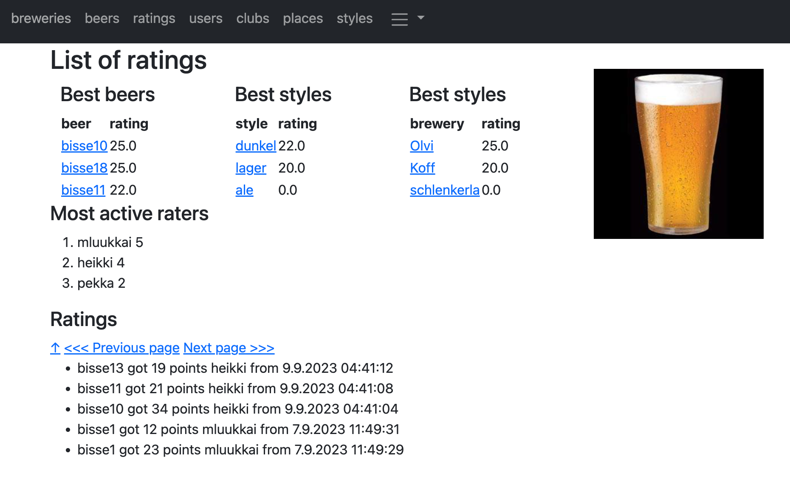

### Turbo framing the beer list

To begin, let's create a new partial called `_beer_list.html.erb` to the folder `app/views/beers` and extract the table containing the beers from our `beers/index.html.erb` file. 

This way, our `index.html.erb` will appear as follows:

**app/views/beers/index.html.erb**

```html
<h1>Beers</h1>

<div id="beers">
  <%= render "beer_list", beers: @beers, page: @page, order: @order, last_page: @last_page  %>
</div>

<%= link_to('New Beer', new_beer_path) if current_user %>
```

Once the above is functioning correctly, we can enclose our table within the `_beer_list.html.erb` partial using a Turbo Frame:

**app/views/beers/\_beer_list.html.erb**

```html
<%= turbo_frame_tag "beer_list_frame" do %>
  <table class="table table-striped table-hover">
    <!-- ... -->
  </table>
<% end %>
```

By using a Turbo Frame, all links and buttons within it will be controlled by Turbo, allowing the rendering of new pages triggered by the links within the Turbo Frame. However, to ensure proper functionality, we need to make a slight modification to our `index` method in `beers_controller.rb` in file path `app/controllers/beers_controller.rb`:

```ruby
def index
  # ...
  if turbo_frame_request?
    render partial: "beer_list",
      locals: { beers: @beers, page: @page, order: @order, last_page: @last_page }
  else
    render :index
  end
end
```

The `turbo_frame_request?` condition ensures that when the request is made within a Turbo Frame, only the partial containing our beer table is returned. We can now observe the behavior within the network tab of our browser's developer tools:

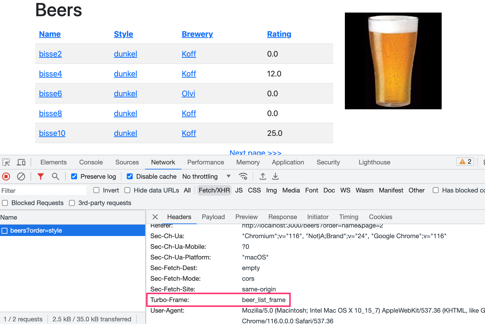

We can see that the headers include the ID of the Turbo Frame we are targeting, allowing Turbo to identify which part of the page should be replaced with the response data:

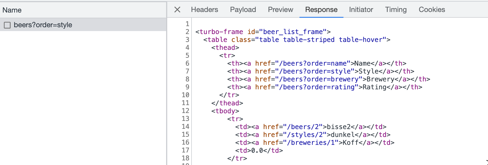

Indeed, the response contains only the partial and excludes the application layout that accompanies the HTML document. The Turbo magic automatically handles this aspect.

The only remaining issue is that the links to beers, breweries, and styles are no longer functional. If we eg. click a beer name, the response looks as follows:


Turbo attempts to replace our table with their content but fails to find a suitable turbo tag (*beer_list_frame*) for replacement so it simply renders nothing within the frame.

We can easily resolve this by adding a suitable target attribute to our links:

**app/views/beers/\_beer_list.html.erb**

```html
<% beers.each do |beer| %>
  <tr>
    <td><%= link_to beer.name, beer, data: { turbo_frame: "_top"} %></td>
    <td><%= link_to beer.style.name, beer.style, data: { turbo_frame: "_top"} %></td>
    <td><%= link_to beer.brewery.name, beer.brewery, data: { turbo_frame: "_top"} %></td>
    <td><%= round(beer.average_rating) %></td>
  </tr>
<% end %>
```

The `turbo_frame="_top"` signifies that Turbo should break out of the frame and replace the entire page with the opened link. As seen from the earlier examples we can also use an ID of another Turbo Frame here, in which case Turbo would attempt to replace that specific frame.

We also notice that the URL remains unchanged when navigating between pages, and using the browser's back button may lead to unexpected results. We can easily address this by promoting our Turbo Actions into visits:

**app/views/beers/\_beer_list.html.erb**

```html
<%= turbo_frame_tag "beer_list_frame", data: { turbo_action: "advance" } do %>
```

#### Asynchronous frame

Let's say we want to suggest a beer to the user based on how they've rated other beers. Calculating the recommendation might take a long time, which is why we decided to load it asynchronously. So initially when the user goes to their own page, it just shows a "loading indicator", and when the recommendation is ready, that gets rendered to the page.

This can be achieved with Turbo frames with a <i>src</i> attribute:

```rb
  <%= turbo_frame_tag "beer_recommendation_tag", src: recommendation_user_path do %>
    calculating the recommendation...
  <% end %>
```

Now initially only the text <i>calculating the recommendation...</i> is rendered. After the page is rendered Turbo makes an HTTP GET request to the specified path (users/id/recommendation) and fills in the HTML that it gets as a response. The partial for the recommendation looks the following:

**view/users/_recommendation.html.erb**

```html
<%= turbo_frame_tag "beer_recommendation_tag" do %>
  <div>
    <h4>Recommendation based on your ratings</h4>

    <p><%= link_to beer.name, beer %> by <%= link_to beer.brewery.name, beer.brewery %></p>
  </div>
<% end %>
```

We will need a route and controller for the recommendation. The route (in *routes.rb*) is defined as follows:

```rb
resources :users  do
  post 'toggle_closed', on: :member
  get 'recommendation', on: :member
end
```

The controller finds out the recommendation (that is in our case just a randomly picked beer) and renders the partial. We have added a sleep of 2 seconds to simulate that calculating the recommendation takes a bit of time:

```rb
class UsersController < ApplicationController
  # ...

  def recommendation
    # simulate a delay in calculating the recommendation
    sleep(2)
    ids = Beer.pluck(:id)
    # our recommendation us just a randomly picked beer...
    random_beer = Beer.find(ids.sample)
    render partial: 'recommendation', locals: { beer: random_beer } 
  end

  # ...
end
```

Now when the user navigates to their own page, there is an indication that the recommendation is still to be calculated:

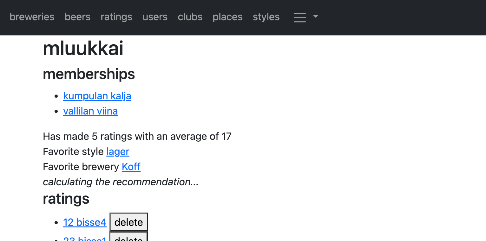

After a while, the HTTP response is ready, and the returned partial containing the recommendation is rendered:

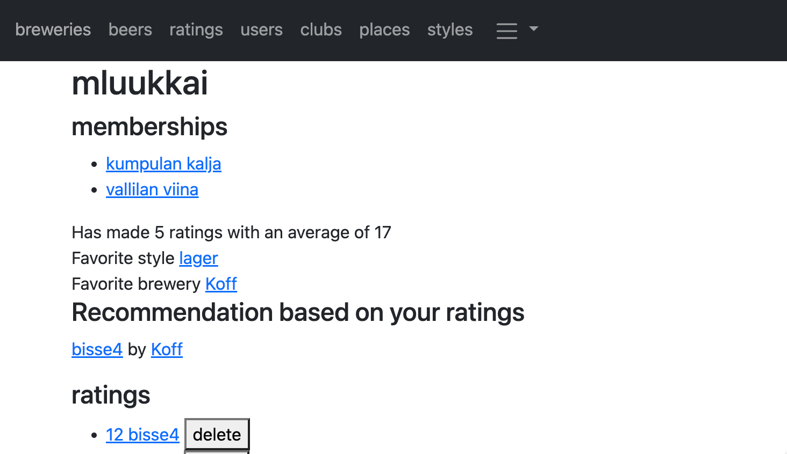

#### Turbo under the hood

As we have seen at the beginning of this week's material, Turbo Frame blocks are identified and separated with ```id``` tags and caught by the controller with the ```turbo_frame_request?```method. The controller then queries the model for the data needed and sends the updated part of HTML to the view. With the help of ID tags, only the specific part inside ```<turbo-frame>``` is updated without having to refresh the entire page. 

Turbo Frames is built on the concept of [AJAX](https://www.w3schools.com/xml/ajax_intro.asp). In a traditional Rails application, a typical HTTP request (like ```GET```) would involve the controller processing the page load request and querying the model's database before delivering an entire HTML page back to the browser. With AJAX, and by extension Turbo Frames, instead of returning a full HTML page, only a section of the page is updated. This leads to faster loading as the application doesn't have to reload all data from the database. Turbo utilizes JavaScript to manipulate the [HTML DOM](https://www.w3schools.com/js/js_htmldom.asp) of the page, eliminating the need for us to write any JavaScript code ourselves!

<blockquote>

## Exercise 3

In this and the next exercise, we will refactor the breweries page to render the brewery lists asynchronously.

Start by refactoring the breweries page so that there is a new partial `_brewery_list.html.erb` which is used separately to list breweries under active breweries and retired breweries.

Create the new endpoint GET `breweries/active` that returns the partial for the active breweries and uses that to render the active breweries asynchronously.

The retired brewery list can still remain as it is.

Note: it is **EXTREMELY IMPORTANT** to follow all the possible error messages, in the Rails console and the network tab of the browser when working with Action Frame!

## Exercise 4

Create also the new endpoint GET `breweries/retired` that returns the partial for the retired breweries and use that also in rendering the breweries page.

The same partial should be used both for active and retired breweries. Note that you **can not** anymore use the **same** Turbo Frame tag for both the active and retired breweries. 

Notice that instead of defining a Turbo Frame tag as a hard-coded string, we can define it also as a variable that you set in the controller:

```rb
<%= turbo_frame_tag tag_as_a_variable do %>
  # ...
<% end %>
```

This makes it possible to use the same partial to render the contents of many different Turbo frames (that all have their own identifiers).

Fix also the links to breweries so that they work inside the Turbo Frames.

</blockquote>

## Turbo Streams

The purpose of [Turbo Streams](https://turbo.hotwired.dev/handbook/streams) is to enable page updates in fragments. For example, when a page displays a list of breweries and a new beer is added or deleted, instead of performing a full page reload, a single brewery can be appended or removed from the list in response to a change.

In modern web applications, achieving this kind of behavior often involves having a separate server-side REST API or GraphQL API, commonly referred to as the back-end, to provide the necessary information in JSON format. The front-end queries this back-end, receives the JSON data, and renders the required HTML while updating the DOM accordingly by using logic written in JavaScript.

Turbo simplifies this process by streaming pre-rendered HTML, compiled on the back-end, directly to the browser and handling the necessary actions internally.

Key concepts in Turbo Streams include **actions**, **targets**, and **templates**. These concepts determine which action should be applied to specific target elements using specific template data.

### Turbo Streams Actions

In Turbo Streams, **actions** are a fundamental concept used to specify the changes or updates that should be performed on the client-side HTML DOM in response to a server-side event. An action represents a specific operation that can be applied to one or more target elements within a Turbo Stream response.

**Actions** are defined using HTML-like syntax and consist of a combination of elements and attributes. Each action includes a target element, which represents the HTML element on the client side that needs to be updated, and one or more operations that define how the target element should be modified.

The operations that can be applied to a target element include:

| Action    | Description                                                      |
| --------- | ---------------------------------------------------------------- |
| `append`  | Appends new content after the target element.                    |
| `prepend` | Prepends new content before the target element.                  |
| `replace` | Replaces the content of the target element with new content.     |
| `update`  | Updates specific attributes or properties of the target element. |
| `remove`  | Removes the target element from the DOM.                         |

### Turbo Streams Targets

For **actions** to function properly, Turbo requires the identification of target elements within the DOM. This can be achieved by assigning unique HTML `id` parameters to individual elements or by utilizing `class` parameters to target multiple elements.

For identifying a single element, one can explicitly create an ID value in the view or leverage the convenient Rails [dom_id](https://api.rubyonrails.org/classes/ActionView/RecordIdentifier.html) helper, which automatically generates the ID tag. For example:

```html
<div id="<%= dom_id(brewery) %>">
  <%= brewery.name %>
</div>
```

This would result in a unique ID like:

```html
<div id="brewery_55">Sinebrychoff</div>
```

Alternatively, when targeting **multiple elements** based on specific [CSS class selectors](https://developer.mozilla.org/en-US/docs/Web/CSS/CSS_Selectors), such as:

```html
<div class="active" id="brewery_55">Sinebrychoff</div>
<div class="active" id="brewery_62">Laitilan Wirvoitusjuomatehdas</div>
<div class="retired" id="brewery_71">Pyynikin käsityöläispanimo</div>
```

you could use the remove action to remove all retired breweries from the list by targeting the class ".retired".

### Turbo Streams Templates

To leverage the capabilities of Turbo Streams, view templates should be designed as [partials](https://guides.rubyonrails.org/layouts_and_rendering.html#using-partials) that can be rendered individually. This enables targeted streaming of changes to specific components. For example, when streaming updates for breweries and appending new breweries to a list, the brewery row should be implemented as a partial.

To prepare the Breweries index page for streaming, extract the row rendering logic (created in Exercise 1) from `app/views/breweries/_brewery_list.html.erb`:

**app/views/breweries/\_brewery_list.html.erb**

```html
<tbody>
  <% breweries.each do |brewery| %>
    <tr>
      <td><%= link_to brewery.name, brewery, data: { turbo_frame: "_top" } %></td>
      <td><%= brewery.year %></td>
      <td><%= brewery.beers.count %></td>
      <td><%= round(brewery.average_rating) %></td>
    </tr>
  <% end %>
</tbody>
```

To new partial file `app/views/breweries/_brewery_row.html.erb`:

**app/views/breweries/\_brewery_row.html.erb**

```html
<tr>
  <td><%= link_to brewery.name, brewery, data: { turbo_frame: "_top"} %></td>
  <td><%= brewery.year %></td>
  <td><%= brewery.beers.count %></td>
  <td><%= round(brewery.average_rating) %></td>
</tr>
```

And change the original code to use this partial:

```html
<tbody id="<%= status %>_brewery_rows">
  <% breweries.each do |brewery| %>
    <%= render "brewery_row", brewery: brewery %>
  <% end %>
</tbody>
```

Pay attention to the new ID that we give to the tbody element. We need `active_brewery_rows` or `retired_brewery_rows` ID to **target** the **action** of appending new breweries as children of the correct table. If in Exercises 3 and 4 you did not define local `status` or something similar containing `active`/`retired` information for the different brewery listings, you should do that now as it will help us later.

Next, let's enable the addition of new breweries directly from the index page. Replace the following code in `app/views/breweries/index.html.erb`:

```html
<%= link_to "New brewery", new_brewery_path if current_user %>
```

With the following Turbo Frame tag:

```html
<%= turbo_frame_tag "new_brewery", src: new_brewery_path if current_user %>
```

This Turbo Frame will include a part of our existing code from the `new_brewery` path.

In `app/views/breweries/_new.html.erb` specify which part of the view you want to show in the Turbo Frame:

```html
<h1>New brewery</h1>

<%= turbo_frame_tag "new_brewery" do %>
  <%= render "form", brewery: @brewery %>
<% end %>
# ...
```

Now the breweries page looks like this:


To append the created brewery to the list without doing a full page update, we need to modify the response in the create action of the `app/controllers/breweries_controller.rb` file.

By adding the `format.turbo_stream` block, we specify that the response should be rendered as a Turbo Stream template with the action of appending the new brewery row to the target element with the ID `active_brewery_rows` or `retired_brewery_rows`. These steps enable the addition of breweries directly from the index page while only appending the created brewery to the list without refreshing the entire page.

```ruby
class BreweriesController < ApplicationController

  def create
    @brewery = Brewery.new(brewery_params)

    respond_to do |format|
      if @brewery.save
        format.turbo_stream {
          status = @brewery.active? ? "active" : "retired"
          render turbo_stream: turbo_stream.append("#{status}_brewery_rows", partial: "brewery_row", locals: { brewery: @brewery })
        }
        format.html { redirect_to brewery_url(@brewery), notice: "Brewery was successfully created." }
        format.json { render :show, status: :created, location: @brewery }
      else
        format.html { render :new, status: :unprocessable_entity }
        format.json { render json: @brewery.errors, status: :unprocessable_entity }
      end
    end
  end

end
```

This change involves one line of code, but under the hood, several components enable this to work:

1. When the browser initiates a new request, the Turbo framework includes the `text/vnd.turbo-stream.html` in the request's `Accept` headers. This informs the server that it expects a Turbo Stream template instead of a full-page update.


2. The controller, based on the `Accept` header, recognizes the request's Turbo Stream format and responds by rendering a Turbo Stream template instead of a complete page. This ensures that only the necessary HTML fragments are sent back to the browser.

3. Using the `turbo_stream.append` method, a response HTML fragment is generated with the action set to `append`. This fragment targets the element with the identifier `brewery_rows` and utilizes the `_brewery_row.html.erb` partial to generate the content. Here is an example of the resulting fragment (go and see yourself from the developer tools how the response looks):

```html
<turbo-stream action="append" target="active_brewery_rows">
  <template
    ><tr id="brewery_65">
      <td>
        <a data-turbo-frame="_top" href="/breweries/65"
          >Laitilan Wirvoitusjuomatehdas</a
        >
      </td>
      <td>1995</td>
      <td>0</td>
      <td>0.0</td>
    </tr></template
  >
</turbo-stream>
```

4. With the table body previously assigned an ID, such as `<tbody id="active_brewery_rows">`, Turbo knows to append the generated template as the last child of the table body element. It intelligently places the new content in the appropriate location. You can test this behavior by removing or altering the ID and observing the resulting outcome.

### Dynamic Updates with ActionCable

[ActionCable](https://edgeguides.rubyonrails.org/action_cable_overview.html) enables dynamic updates by utilizing [WebSockets](https://en.wikipedia.org/wiki/WebSocket), providing real-time streaming of content to multiple browsers. Unlike traditional request-response logic, which requires the browser to send a request and await a response, ActionCable allows seamless updates without the need to refresh the page. This functionality has been available since Rails version 5 and is based on WebSockets technology. For a very brief tutorial on WebSockets, see [WebSockets in 100 seconds](https://www.youtube.com/watch?v=1BfCnjr_Vjg).

To establish a connection between the browser and the server for listening to changes, we define a stream or channel. In our view file, `app/views/breweries/index.html.erb`, we "subscribe" to updates using the following line of code:

**app/views/breweries/index.html.erb**

```html
<%= turbo_stream_from "breweries_index" %>
```

This code establishes a WebSocket connection between the browser and the server, enabling the browser to receive real-time updates.

To publish updates, we utilize the Brewery model `app/models/brewery.rb`. Whenever a new brewery is created, the following code is triggered:

**app/models/brewery.rb**

```ruby
class Brewery < ApplicationRecord
  include RatingAverage
  extend TopRated

  # ...

  after_create_commit do 
    target_id = if active
      "active_brewery_rows"
    else
      "retired_brewery_rows"
    end

    broadcast_append_to "breweries_index", partial: "breweries/brewery_row", target: target_id
  end
end
```

Ruby on Rails calls the [callback](https://guides.rubyonrails.org/active_record_callbacks.html) function [after_create_commit](https://api.rubyonrails.org/v7.0.8/classes/ActiveRecord/Transactions/ClassMethods.html#method-i-after_commit) always when a new object is created.

The callback function broadcasts an `append` action to the `breweries_index` channel, targeting the element with the ID `active_brewery_rows` or `retired_brewery_rows`. It uses the `_brewery_row.html.erb` partial to create the template for the new brewery. Essentially, it replicates the same functionality we implemented earlier by responding to client requests with fragments. However, the difference lies in the fact that the HTML fragment is now broadcasted to **all browsers** subscribed to the `breweries_index` channel, thanks to the power of WebSockets.

You can test the functionality by opening two browser windows side by side and creating a new brewery. You'll observe that the updates are instantly reflected in both windows, demonstrating the real-time nature of ActionCable and WebSockets.

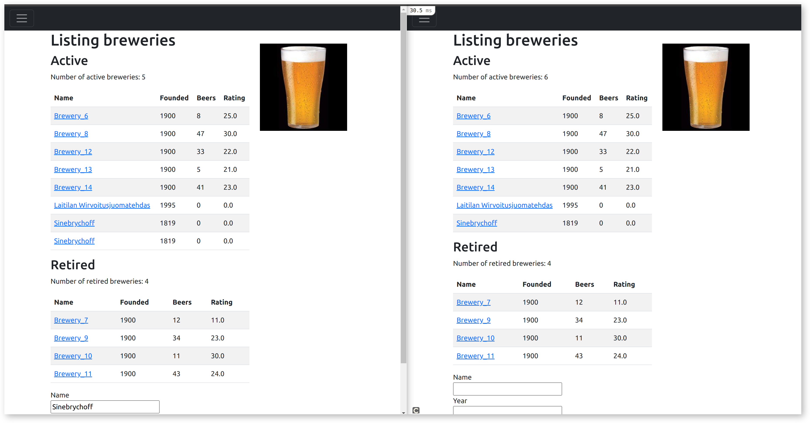

During the process, you may have noticed a problem: when a user adds new breweries, duplicate entries appear in the list. Let's take a moment to understand why this happens.

The reason is that the current user actually receives the fragments twice. Firstly, as an HTTP response to the form submission triggered by the create action in the controller. Secondly, as a WebSocket update triggered by the `after_create_commit` hook in the model.

To address this issue, there are several possible solutions:

1. Comment out the stream template in the HTTP response from the controller. However, this approach has a downside: if there are any issues with WebSockets, the user won't see the effect of submitting a new brewer.

2. Conditionally trigger the `after_create_commit` hook in the model based on the logged-in user. This approach ensures that the user only receives the WebSocket update once. This is pretty tricky to implement and would require the use of user-specific streams.

3. Opt for a simpler solution by giving each row a unique identifier. Let's proceed with this approach here.

In `app/views/breweries/_brewery_row.html`, add the following line of code:

**app/views/breweries/\_brewery_row.html**

```html
<tr id="<%= dom_id(brewery) %>">
  <td>...
```

By assigning a unique identifier to each row, we prevent duplication. This unique identifier becomes essential if we want to trigger actions, such as removing a specific brewery.

To observe the WebSocket connection details, you can use the browser's developer tools.


It's worth noting that in our example, we used a simple string, `breweries_index`, as the identifier for the channel since there is only one `breweries_index`. However, in certain scenarios, you may want to use an object to identify the stream. For instance, if you implement the ability to add new beers to a specific brewery from the Brewery page and stream the added data only to that page, you would want to use something like `@brewery` instead of `"breweries_index"`. This way, different brewery pages can be targeted with the streaming updates.

<blockquote>

## Exercise 5

With Turbo Streams and Action Cable, we are now equipped to create a beer chat for the users of our app!

You need a model for the messages. Each message has the text content and ID of the creator. Note the order of the messages, the most recent is shown at the top!

Note: it is **EXTREMELY IMPORTANT** to follow all the possible error messages, in the Rails console and the network tab of the browser especially when working with Action Cable!
</blockquote>
Your solution could look like the following:

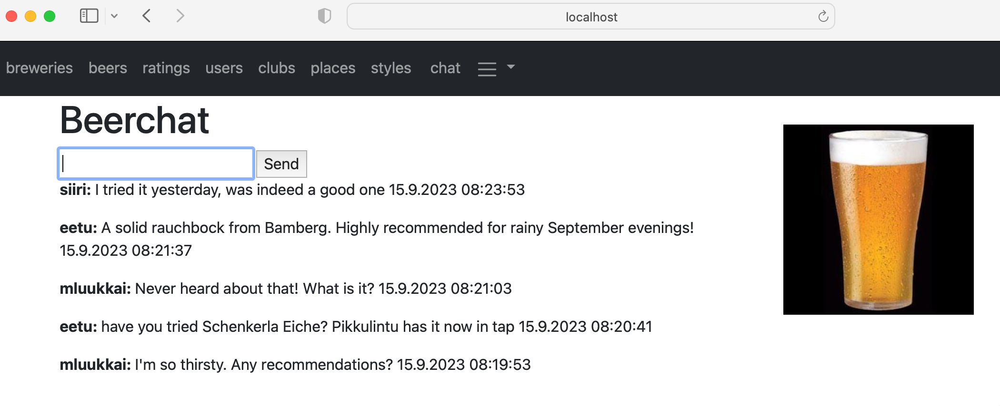
<blockquote>

## Exercise 6

Enhance the breweries list functionality by adding a button or text "X" for removing a brewery from the database.

The implementation should follow these steps:

Initially, make the removal work without using Turbo, requiring a full page reload after the delete action.

Improve the functionality by dynamically removing the deleted brewery from the list using Turbo Streams. Ensure the removal is reflected in the UI without requiring a full page reload.

Note: you might end up trying the following

```html
link_to("X", brewery, method: :delete) %>
```

this was a proper way to make a delete request in Rails up to version 6. In Rails 7 you need to specify the HTTP request verb a bit differently:

```html
link_to("X", brewery, data: {turbo_method: :delete }) %>
```

## Exercise 7

Leverage WebSockets to stream the removal action to all connected browsers in real time.

Enhance the user experience by introducing a confirmation pop-up. When a user clicks the remove button, a confirmation dialog should appear with the text "Are you sure you want to remove brewery X and all beers associated with it?". The pop-up should provide options for "Cancel" and "Remove" actions.

You will [here](https://www.rubydoc.info/gems/turbo-rails/0.5.2/Turbo/Broadcastable) a suitable broadcast method. You might need to google a bit to get the parameters right.

## Exercise 8

Notice that _Number of Active Breweries_ and _Number of Retired Breweries_ require a full page reload to reflect the actual numbers. Make these numbers dynamic so that any addition or retirement of a brewery by the user triggers real-time updates. The changes should be streamed to reflect the updated counts instantly. In this exercise, the change made by other user/browsers does not need to affect the counts so Action Cable is not yet needed.

Hint: you can render multiple Turbo Stream messages from a controller response by placing them in an array.

## Exercise 9

Extend the solution of the previous exercise to leverage Action Cable so that the brewery counts are updated also when somebody other creates or deletes a brewery.

</blockquote>

## Stimulus

[Stimulus](https://stimulus.hotwired.dev/) is a JavaScript framework designed to enhance interactivity in HTML, eliminating the need for extensive custom JavaScript development. By utilizing a set of JavaScript modules that can be seamlessly attached to HTML elements using specific attributes, Stimulus enables developers to create simpler and more maintainable code.

One of the notable advantages of Stimulus is its seamless integration with Rails, making it an ideal choice for web applications built on the Rails framework. Leveraging the latest browser technologies, Stimulus delivers a fast and seamless user experience, ensuring optimal performance.

Stimulus utilizes key concepts such as **controllers**, **actions**, **targets**, and **values** to determine the appropriate actions to apply to specific target elements based on specific data.

**Benefits**

- Reduces the amount of custom JavaScript required to implement common functionality, streamlining development efforts.
- Provides a straightforward and intuitive API for dispatching and listening to events on webpages, simplifying event handling.
- Enhances performance by avoiding the overhead associated with full-fledged JavaScript frameworks.

**Considerations**

- Stimulus may not be the ideal choice for complex applications that demand extensive client-side functionality.
- Careful organization and structuring of Stimulus controllers is necessary to prevent bloated and unmanageable code.
- Developers who are unfamiliar with the Stimulus framework may experience a learning curve and added complexity during development.

### Deleting ratings

Let's try our hand at Stimulus by implementing a feature that allows users to delete multiple beer ratings at once without the need for a full page reload.

We can start by creating a new partial file named `_ratings.html.erb` within the `/app/views/users` folder.

Then we extract the rating code section (shown below) from the `/app/views/users/show.html.erb` file and place it into the ratings partial file.

**/app/views/users/\_ratings.html.erb**

```html
<ul>
  <% @user.ratings.each do |rating| %>
    <li>
      <%= link_to "#{rating.score} #{rating.beer.name}", rating, data: { turbo_frame: "rating_details" }  %>
      <% if @user == current_user %>
        <%= button_to 'delete', rating, method: :delete, form: { style: 'display:inline-block;',  data: { 'turbo-confirm': 'Are you sure?' } } %>
      <% end %>
    </li>
  <% end %>
</ul>
```

Then we delete the ratings code from the `/app/views/users/show.html.erb` file and insert the ratings partial using the `<%= render partial: 'ratings' %>` statement under the ratings header.

**/app/views/users/show.html.erb**

```html
<h4>Ratings</h4>
<%= render partial: 'ratings' %>
```

We can then modify the partial by removing the list elements and the delete button from the `/app/views/users/_ratings.html.erb` file, like so:

**/app/views/users/\_ratings.html.erb**

```html
<div class="ratings mb-4">
  <% @user.ratings.each do |rating| %>
    <div class="rating">
      <% if @user == current_user %>
        <input type="checkbox" name="ratings[]" value="<%= rating.id %>" />
      <% end %>
      <span>
        <%= link_to "#{rating.score} #{rating.beer.name}", rating, data: { turbo_frame: "rating_details" }  %> 
      </span>
    </div>
  <% end %>
  <% if @user == current_user %>
    <button>Delete selected</button>
  <% end %>
</div>
```

With the modified templates ready, let's update the `routes.rb` file to handle the ratings destroy action. Remove the `destroy` action from the rating resources and add a separate delete method to handle the removal of rating IDs.

**/app/config/routes.rb**

```ruby
resources :ratings, only: [:index, :new, :create, :show]
delete 'ratings', to: 'ratings#destroy'
```

Modify the `destroy` method within the `ratings_controller.rb` to handle the deletion of multiple rating IDs. We can do it like this:

**app/controllers/ratings_controller.rb**

```ruby
def destroy
  destroy_ids = request.body.string.split(',')
  # Loop through multiple rating IDs and delete them if they exist and belong to the current user
  destroy_ids.each do |id|
    rating = Rating.find_by(id: id)
    rating.destroy if rating && current_user == rating.user
  # Rescue in case one of the rating IDs is invalid so we can continue deleting the rest 
  rescue StandardError => e
    puts "Rating record has an error: #{e.message}"
  end
  @user = current_user
  respond_to do |format|
    format.html { render partial: '/users/ratings', status: :ok, user: @user }
  end
end
```

Right now the delete button does not really do anything as it's not connected to our route or controller any way. This is where we start using Stimulus.

### Stimulus Controllers

The basic organizational unit of a Stimulus application is a [controller](https://stimulus.hotwired.dev/reference/controllers).

When working with Stimulus, it is essential to follow a specific naming convention for **controller** files. Each controller file should be named in the format `[identifier]_controller.js`, where the identifier corresponds to the data-controller attribute associated with the respective controller in your HTML markup. By adhering to this naming convention, Stimulus can seamlessly link the controllers in your HTML with their corresponding JavaScript files.

Let's start by creating a `ratings_controller.js` and putting it to file path `/app/JavaScript/controllers/ratings_controller.js`:

**/app/JavaScript/controllers/ratings_controller.js**

```JavaScript
import { Controller } from "@hotwired/stimulus";

export default class extends Controller {
   // We'll talk about the connect in a second... 
   connect() {
      console.log("Hello, Stimulus!");
   }
}
```

In our `_ratings.html.erb` we can edit `<div>` element with the `data-controller` attribute, with value `ratings`.

```html
<div data-controller="ratings" class="ratings mb-4">
  # ...
</div>
```
This binds it to the Stimulus controller named `ratings_controller.js`. It's important to note that the scope of a Stimulus controller includes the element it is connected to and its children, but not the surrounding elements.

We can then reload the page and see from the console log that we have indeed connected to the Stimulus controller.


`connect()` is a callback method that Stimulus supports out of the box which is executed when the controller is connected to the DOM.

### Lifecycle Methods

[Lifecycle](https://stimulus.hotwired.dev/reference/lifecycle-callbacks) methods in Stimulus provide a capability for executing code at specific stages in the lifecycle of a controller. These methods, defined within the controller class, offer hooks for initialization, connection to the DOM, and disconnection from the DOM.

Here is an example showcasing the available lifecycle methods in a Stimulus controller:

```JavaScript
import { Controller } from 'stimulus';

export default class extends Controller {
  initialize() {
    // Executed once when the controller is first instantiated
  }

  [name]TargetConnected(target) {
    // Executed anytime a target is connected to the DOM
  }

  [name]TargetDisconnected(target) {
    // Executed anytime a target is disconnected from the DOM
  }

  connect() {
    // Executed when the controller is connected to the DOM
  }

  disconnect() {
    // Executed when the controller is disconnected from the DOM
  }
}
```

These lifecycle methods provide developers with the flexibility to perform specific tasks at appropriate points in the controller's lifecycle. The `initialize` method can be used for initial setup or one-time actions. The `[name]TargetConnected` and `[name]TargetDisconnected` methods enable dynamic handling of targets as they are connected or disconnected from the DOM. The `connect` and `disconnect` methods offer a convenient way to set up or clean up resources associated with the controller when it is connected or disconnected from the DOM.

By leveraging these lifecycle methods, developers can ensure proper initialization, respond to changes in DOM state, and maintain organized and maintainable code in their Stimulus controllers.

### Stimulus Actions

[Actions](https://stimulus.hotwired.dev/reference/actions) in Stimulus are methods defined within a controller that respond to user events or changes in the application state. These actions are identified using the data-action attribute and can be triggered by various events, such as clicks, form submissions, or custom events.

Let's add an action to our `<button>` element, data-action attributes are used with the format `event->controller#method`.

**/app/views/users/\_ratings.html.erb**

```html
<div data-controller="ratings" class="ratings mb-4">
  # ...
  <% if @user == current_user %>
    <button data-action="click->ratings#destroy">Delete selected</button>
  <% end %>
</div>
```

Here a click event listener is attached to the `<button>` element with the controller identifier `ratings`, and it calls the `destroy` method when clicked.

Stimulus provides default events for certain elements, which means that the click event can be omitted from the data-action attribute for buttons. For example, `<button data-action="ratings#destroy">Delete selected</button>` would achieve the same result.

Here is a complete list of elements and their default events:

| Element             | Default Event |
| ------------------- | ------------- |
| `a`                 | `click`       |
| `button`            | `click`       |
| `details`           | `toggle`      |
| `form`              | `submit`      |
| `input`             | `input`       |
| `input type=submit` | `click`       |
| `select`            | `change`      |
| `textarea`          | `input`       |

We can now write the `destroy` method in our `ratings_controller.js`:

**/app/JavaScript/controllers/ratings_controller.js**

```JavaScript
import { Controller } from "@hotwired/stimulus";

export default class extends Controller {
  destroy() {
    // Confirmation dialog for the user
    const confirmDelete = confirm(
      "Are you sure you want to delete these selected ratings?"
    );
    if (!confirmDelete) {
      return;
    }
    
    // Retrieve the selected rating IDs from the checkboxes
    const selectedRatingsIDs = Array.from(
      document.querySelectorAll('input[name="ratings[]"]:checked'),
      (checkbox) => checkbox.value
    );
    
    // Include the CSRF token in the request headers so that Rails recognizes us as the logged in user
    const csrfToken = document.querySelector('meta[name="csrf-token"]').content;
    const headers = { "X-CSRF-Token": csrfToken };

    // Send a DELETE request to the ratings controller with the selected rating IDs
    fetch("/ratings", {
      method: "DELETE",
      headers: headers,
      body: selectedRatingsIDs.join(","),
    })
      .then((response) => {
        if (response.ok) {
          response.text().then((html) => {
            document.querySelector("div.ratings").innerHTML = html;
          });
        } else {
          throw new Error("Something went wrong");
        }
      })
      .catch((error) => {
        console.log(error);
      });
  }
}
```
And now we finally have a working delete button for deleting multiple ratings!

### Beer tax calculator

To showcase a bit more Stimulus features we'll build a handy beer tax calculator for our application so that you know how much you are supporting Helsinki University and other public services with each beer bought. To start let's add a new path to our `routes.rb`.

**/config/routes.rb**

```ruby
Rails.application.routes.draw do
   #...
   get 'calculator', to: 'misc#calculator'
   # ...
end
```

And create a new controller file for into path:

**/app/controllers/misc_controller.rb**

```ruby
class MiscController < ApplicationController
   def calculator
   end
end
```

And then add a link for the calculator to our navbar:

**/app/views/layouts/application.html.erb**

```html
<!--(...)-->
<li class="nav-item">
  <%= link_to 'styles', styles_path, { class: "nav-link" } %>
</li>
<li class="nav-item">
  <%= link_to 'tax calculator', calculator_path, { class: "nav-link" } %>
</li>
<!--(...)-->
```

Lastly we can create a Stimulus controller file for our calculator to `app/JavaScript/controllers`:

**/app/JavaScript/controllers/calculator_controller.js**

```JavaScript
import { Controller } from "@hotwired/stimulus";

export default class extends Controller {}
```

#### Stimulus Targets

[Targets](https://stimulus.hotwired.dev/reference/targets) in Stimulus are special attributes that allow a controller to reference and manipulate specific elements within its scope. To define targets, you need to add the `data-[controller name]-target` attribute to the HTML elements. Stimulus scans your controller class and identifies target names in the static `targets` array. It automatically adds three properties for each target name: `[name]Target`, which evaluates to the first matching target element, `[name]Targets`, which evaluates to an array of all matching target elements, and `has[Name]Target`, which returns boolean value `true` or `false` depending on the presence of a matching target.

Let's create a form for our calculator containing some targets to collect.
```html
<h2>Beer tax calculator</h2>

<div data-controller="calculator" class="container">
   <form data-action="calculator#calculate">
      <div>
         <label>Amount</label>
         <input type="number" min="0" step="0.001" value="0.000" required="true" data-calculator-target="amount" />
         <label>liters</label>
      </div>
      <div>
         <label>Alcohol by volume (ABV)</label>
         <input type="number" min="0" step="0.01" value="0.00" required="true" data-calculator-target="abv" />
         <label>%</label>
      </div>
      <div>
         <label>Price </label>
         <input type="number" min="0" step="0.01" value="0.00" required="true" data-calculator-target="price" />
         <label>€</label>
      </div>
      </br>
      <button>Calculate</button>
   </form>
   </br>
   <div id="result">
   </div>
</div>
```

To add target names to the controller's list of target definitions, you need to update the `calculator_controller.js` file accordingly. This will automatically create properties with names `[name]Target` for each which returns the first matching target element. You can then use this property to read the value of the element and for testing print each value to the console.

**/app/JavaScript/controllers/calculator_controller.js**

```JavaScript
import { Controller } from "@hotwired/stimulus";

export default class extends Controller {
   static targets = ["amount", "abv", "price"];

   calculate(event) {
      // Prevent the default form submission from reloading the page.
      event.preventDefault();
      const amount = parseFloat(this.amountTarget.value);
      const abv = parseFloat(this.abvTarget.value);
      const price = parseFloat(this.priceTarget.value);
      console.log(amount, abv, price);
   }
}
```

When testing the submit button we can see that we are getting the values printed to the JavaScript console.


#### Stimulus Values

[Values](https://stimulus.hotwired.dev/reference/values) in Stimulus are a way to store and access data within a controller using the `value` method. These values can be declared in various ways, such as static values defined in the controller, attributes on HTML elements, or dynamic values.

For our calculator app, we could create an attribute for having value saved for value-added tax. Let us define the value in the controller:

```rb
class MiscController < ApplicationController
  def calculator
    @vat = 0.24
  end
end
```

Now we can create the data attribute `data-calculator-vat-value` based on the initial value given by the controller:

```html
<h2>Beer tax calculator</h2>
<div data-controller="calculator" data-calculator-vat-value="<%= @vat %>" class="container">
   <form data-action="calculator#calculate">
      // (...)
      <div>
         <p>Value added tax <%= @vat * 100 %>%</p>
      </div>
      </br>
      <button>Calculate</button>
   </form>
   </br>
   <div id="result">
   </div>
</div>
```


In the controller file `calculator_controller.js`, a static `values` array is created, including the attribute name `vat` with a type of `Number`. By adding the attribute `data-calculator-vat-value="0.24"` to the `<div>` element, the value `0.24` is assigned to the `vatValue` variable in the controller and converted into number with JavaScript's `Number()` -function. This value can then be accessed and used within the controller's code.

Now we can finish the code for our calculator:

```JavaScript
import { Controller } from "@hotwired/stimulus";

export default class extends Controller {
   static targets = ["amount", "abv", "price"];
   static values = { vat: Number };
   calculate(event) {
      event.preventDefault();
      const amount = parseFloat(this.amountTarget.value);
      const abv = parseFloat(this.abvTarget.value);
      const price = parseFloat(this.priceTarget.value);
      // Amounts of alcohol tax per liter of pure alcohol for beers.
      let alcoholTax = 0;
      switch (true) {
         case (abv < 0.5):
            alcoholTax = 0;
         case (abv <= 3.5):
            alcoholTax = 0.2835;
         case (abv > 3.5):
            alcoholTax = 0.3805;
      }
      const beerTax = (amount * abv * alcoholTax);
      const vatAmount = (price - price / (1.0 + this.vatValue));
      const taxPercentage = ((beerTax + vatAmount) / price * 100);

      // search for the element where the result is shown
      const result = document.getElementById("result")
      result.innerHTML = `
        <p>Beer has ${beerTax.toFixed(2)} € of alcohol tax and ${vatAmount.toFixed(2)} € of value added tax.</p>
        <p> ${taxPercentage.toFixed(1)} % of the price is taxes.</p>`
   }
}
```

The code uses [document.getElementById](https://developer.mozilla.org/en-US/docs/Web/API/Document/getElementById) to find the `div` element that has the ID `result`. The result is set to the element using the [innerHTML](https://developer.mozilla.org/en-US/docs/Web/API/Element/innerHTML) attribute.

And now we have a beautifully working beer tax calculator!


<blockquote>

## Exercise 10

Add caclulator a button that can be used to reset all the input values to value zero:

</blockquote>

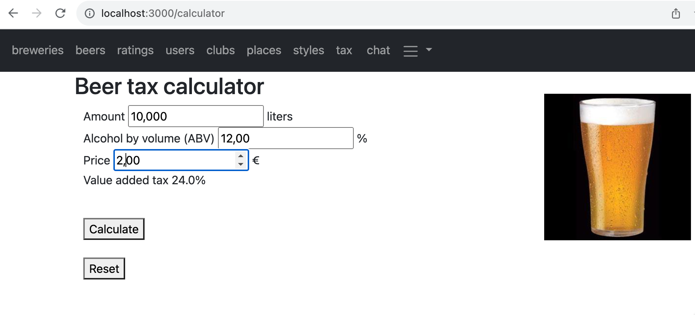

<blockquote>

## Exercise 11

Improve the beer tax calculator by changing the amount field to be a dropdown selection, implemented with the [select](https://developer.mozilla.org/en-US/docs/Web/HTML/Element/select) component, containing the most common beer can and bottle sizes, for example 0.33, 0.375, 0.5, 0.66, 0.75, 1, 1.3 and 1.5 liters.

## Exercise 12

Continuing from exercise 11, add the option `Custom` to the dropdown. 
When the custom option is selected, the amount is taken from a user-fillable custom amount field:

For the time being the custom field can remain visible all the time.

</blockquote>

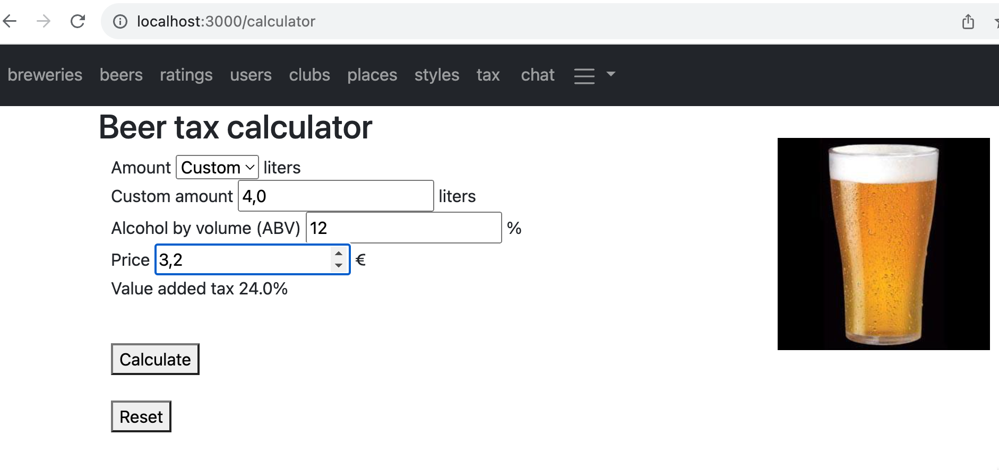

<blockquote>

## Exercise 13

Fine-tune the solution so that there a is user fillable custom amount field added to the form **only** when the "custom" option is selected. If the user switches back to the pre-defined amount in the dropdown, the custom amount field gets removed from the form.

Note that it is possible to attach a controller function to a select component that is executed always when a new option is selected:

```html
<select data-calculator-target="amount" data-action="calculator#change">
  ...
</select>
```

```js
import { Controller } from "@hotwired/stimulus";

export default class extends Controller {
  // ...

  change(event) {
    // a new option was selected!
    console.log(event.target.value)
  } 

  // ...
}
```

## Exercise 14

Let us get back to the users' rating list.

Add a _select all_ checkbox input to `users/ratings? partial that selects/deselects all users' ratings when that checkbox is selected/deselected.

</blockquote>

Your solution could look like this:


<blockquote>

## Exercise 15

Now it is time to use Stimulus in fine-tuning the breweries page!

When we add new breweries to the brewery page, our form does not get emptied out after adding the brewery. We shall fix this in the next exercise but let us warm up and add first a button that can be used to empty the input fields.

Hint: You can add a `data-form-target` attribute to an input field as follows:

```html
  <%= form.text_field :name, data: { "form--target": "name" } %>
```

## Exercise 16

Use now Stimulus to clear all form inputs after the form is submitted.

Hint: Turbo offers `turbo:submit-end` event that is fired after the form is submitted which you can use to trigger an action. More turbo events can be found here: https://turbo.hotwired.dev/reference/events

It might be a bit tricky to have the data-action attribute properly defined. Remember that you have to use the "long" form (with an arrow) since the event we use is not the default.

## Exercise 17

As the final exercise of this part, you shall make a brewery creation a bit easier with the use of [Avoin data](http://avoindata.prh.fi/) (Open data) API that provides a list of Finnish breweries in the endpoint

```
https://avoindata.prh.fi/bis/v1?totalResults=true&maxResults=500&businessLine=Oluen%20valmistus
```

Add the creation form a select drop-down that gets its data (breweries) from the above API endpoint. The select drop-down could be used to prefill the input fields.

You can assume the year of the registration date as the year of the brewery's establishment unless it is before the 1980's as those records don't seem to match the actual establishment year. You may leave the year field empty for those.

</blockquote>

Your solution should work as follows. The user can fill in the info of a brewery either in the old way (by writing to text fields), or select a brewery from the drop-down:


If the user selects a brewery, its name and the year are filled to the text fields:


## ActionCable, Redis, and Heroku / Fly.io Integration

It is not necessary to deploy your final version to the cloud but if you do so, here are some tips to get everything set.

To ensure seamless operation of **ActionCable**, the foundational component for Turbo Streams, in a production environment, it is necessary to have [Redis](https://redis.io/) installed. Please follow the steps outlined below to ensure a proper configuration.

### Heroku

1. **Verify Redis Installation**

Check if you already have a Redis add-on by running the following command in your terminal:

`$ heroku addons | grep heroku-redis`

If no Redis add-on is listed, proceed to create a Redis instance using the command:

`$ heroku addons:create heroku-redis:mini -a your-app-name`

2. **Gemfile Configuration**

By default,  Heroku configures your `Gemfile` with a Redis gem version higher than 5. However, if you are running a Rails version lower than 7.0.4, you will need an older version of the gem. Update your `Gemfile` with the following Redis configuration:

```ruby
gem "redis", ">= 3", "< 5"
```

### Fly.io

1. **Verify Redis Installation**

Check if you already have a Redis instance by running the following command in your terminal:

`$ fly redis list`

If no Redis instance is listed or if you encountered issues during the installation process (e.g., failure during `fly launch`), proceed to create a Redis instance using the command:

`$ fly redis create`

2. **Fetch Redis Address and Configure the Server**

Retrieve the Redis address by executing the following command in your terminal:

`$ fly redis status <your-redis-instance-name>`

This command will provide detailed information, including a line displaying the private URL in the format: `Private URL = redis://default:somethingsomething...something.upstash.io`. Configure the server by setting the Redis URL as a secret. Execute the command:

`$ fly secrets set REDIS_URL=redis://default:somethingsomething...something.upstash.io`

3. **Gemfile Configuration**

By default, Fly.io configures your `Gemfile` with a Redis gem version higher than 5. However, if you are running a Rails version lower than 7.0.4, you will need an older version of the gem. Update your `Gemfile` with the following Redis configuration:

```ruby
gem "redis", ">= 3", "< 5"
```

## Submitting the exercises

Commit all your changes and push the code to GitHub. Remember to check with Rubocop that your code still adheres to style rules. Deploying the newest version of Heroku or Fly.io is voluntary!

Mark the exercises you have done at https://studies.cs.helsinki.fi/stats/courses/rails2023-hotwire notice that for this part there is a separate course instance in the submission system! 

See [here](/web/ilmoittautuminen-english.md) for the info on how to get the University of Helsinki credits for this part registered!
